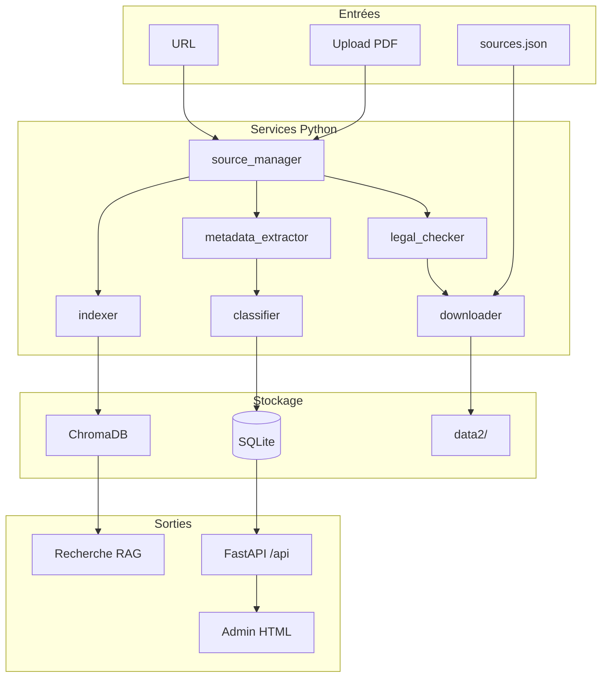

# Architecture — Psych IA Ressources

Outil local de **collecte**, **vérification légale**, **classification** et **indexation RAG** de ressources pédagogiques en psychologie (L1, L2, L3).

## Vue d’ensemble



## Modules

| Module | Rôle |
|--------|------|
| `app/core/enums.py` | Niveaux, matières, types, statuts légaux, résolution chemins `data2/` |
| `app/services/legal_checker.py` | Heuristiques licence / domaine / rejet paywall |
| `app/services/downloader.py` | Téléchargement PDF, robots.txt, dédoublonnage hash SHA-256 |
| `app/services/classifier.py` | Inférence niveau / matière / difficulté par mots-clés |
| `app/services/metadata_extractor.py` | PyMuPDF : texte, métadonnées, résumés courts |
| `app/services/source_manager.py` | Orchestration ajout source → document → index |
| `app/services/indexer.py` | Chunks + embeddings + ChromaDB |
| `app/api/routes.py` | REST : sources, upload, search, concepts |
| `app/admin/` | Interface HTML (Jinja2 + JS) |

## Pipeline d’ajout d’une source

1. **Entrée** : URL (`POST /api/sources/url`) ou fichier (`POST /api/sources/upload`).
2. **Légal** : `legal_status` ∈ `open_access` \| `created_by_user` \| `authorized` \| `unknown` \| `rejected`.
3. **Téléchargement** : refus si `unknown` (sauf marquage manuel `authorized`) ou `rejected`.
4. **Stockage** : `data2/{niveau}/{matière}/` avec nom `{hash12}_{titre}.pdf`.
5. **Métadonnées** : extraction + classification → table `documents`.
6. **Indexation** : automatique si statut RAG-éligible ; chunks dans `document_chunks` + collection Chroma `psychologie_ressources`.

## Arborescence `data2/`

```
data2/
├── L1/ … L2/ … L3/
├── recherche_avancee/ HAL, CNRS, INSERM, articles_open_access, meta_analyses
├── ressources_libres/ OpenStax, glossaires, statistiques
└── mes_donnees/ fiches, quiz, exercices, cartes mentales, erreurs, liens
```

Variable d’environnement : `PSYCH_IA_DATA_DIR` (défaut : `data2`).

## Base de données (SQLite)

- `sources` — entrée brute (URL, statut, erreurs, doublons)
- `documents` — métadonnées complètes + chemin local + hash
- `document_chunks` — texte + citation + lien Chroma
- `concept_links` — graphe de notions (import depuis `concepts_links.json`)
- `index_jobs` — journal d’indexation

## Index RAG

Chaque chunk Chroma porte : `source_id`, `title`, `page`, `subject`, `level`, `legal_status`, `url`, `citation`, `difficulty`, `document_type`.

Recherche : `POST /api/search` avec filtres `level`, `subject` ; exclusion automatique des `unknown` / `rejected`.

## Fichiers de configuration

| Fichier | Usage |
|---------|--------|
| `sources.json` | Sources initiales (référentiels, HAL, OpenStax, banques utilisateur) |
| `concepts_links.json` | Graphe notion → liens |
| `config/system_rules.txt` | Règles IA (non diagnostic, citations, 3114) |

## Scripts CLI

- `scripts/download_sources.py` — parcourt `sources.json` (`download: true` uniquement)
- `scripts/index_documents.py` — indexe tous les documents éligibles

## Sécurité juridique (rappel)

La détection est **heuristique**. L’utilisateur doit valider les cours universitaires sans mention de licence (`unknown` → pas de RAG auto). Jamais Sci-Hub / LibGen / contournement paywall.
